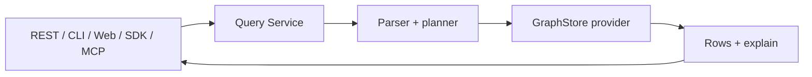

# Query Surfaces

中文：[查询入口](../../zh/concepts/query-surfaces.md)

Query Service is the public read surface for UModel. REST, CLI, Web UI, SDKs, and MCP tools all converge on the same query concepts.


## Sources

| Source | Reads | Example |
|---|---|---|
| `.umodel` | Model definitions | `.umodel with(kind='entity_set')` |
| `.entity_set` | EntitySet method responses | `.entity_set with(domain='devops', name='devops.service') &#124; entity-call __list_method__()` |
| `.entity` | Runtime entity records | `.entity with(domain='devops', name='devops.service')` |
| `.topo` | Runtime topology relations | `.topo &#124; graph-call getDirectRelations(...)` |

## Query Flow



## Execute Versus Explain

Execute returns rows:

```bash
go run ./cmd/umctl --addr http://localhost:8080 query run demo ".umodel | limit 5"
```

Explain returns the query plan before UI, SDK, or agent integration:

```bash
go run ./cmd/umctl --addr http://localhost:8080 query explain demo ".entity with(domain='devops', name='devops.service') | limit 5"
```

Explain output: source, provider, planned operators, and limit behavior.

## Boundary

Domain reads should not bypass Query Service. This is enforced by architecture guard tests and keeps public clients aligned:

- No public entity lookup endpoint outside Query Service.
- No public relation lookup endpoint outside Query Service.
- No public graph traversal endpoint outside Query Service.
- No CLI domain read commands outside `query run` and `query explain`.

## Agent Usage

AgentGateway exposes Query Service through tools such as:

- `query_spl_execute`
- `query_spl_explain`
- `query_spl_examples`

Resources remain metadata-oriented by default; runtime rows should be returned by tools.

## Related References

- [Query Service Guide](../guides/query-service.md)
- [MCP Reference](../reference/mcp.md)
