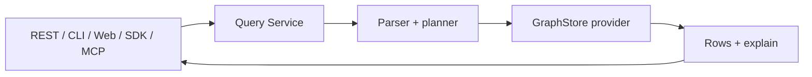

# 查询入口

English: [Query Surfaces](../../en/concepts/query-surfaces.md)

Query Service 是 UModel 的公共读取面。REST、CLI、Web UI、SDK 和 MCP tools 都收敛到同一套查询概念。


## Sources

| Source | 读取内容 | 示例 |
|---|---|---|
| `.umodel` | 模型定义 | `.umodel with(kind='entity_set')` |
| `.entity_set` | EntitySet 方法响应 | `.entity_set with(domain='devops', name='devops.service') &#124; entity-call __list_method__()` |
| `.entity` | 运行时实体 | `.entity with(domain='devops', name='devops.service')` |
| `.topo` | 运行时拓扑关系 | `.topo &#124; graph-call getDirectRelations(...)` |

## 查询流程



## Execute 与 Explain

执行查询：

```bash
go run ./cmd/umctl --addr http://localhost:8080 query run demo ".umodel | limit 5"
```

Explain 查询计划：

```bash
go run ./cmd/umctl --addr http://localhost:8080 query explain demo ".entity with(domain='devops', name='devops.service') | limit 5"
```

Explain 输出 source、provider、planned operators 和 limit 行为。

## 边界

领域读取不应绕过 Query Service：

- 不新增独立 entity lookup 公共 endpoint。
- 不新增独立 relation lookup 公共 endpoint。
- 不新增独立 graph traversal 公共 endpoint。
- CLI 读取统一使用 `query run` 和 `query explain`。

## Agent 用法

AgentGateway 通过工具暴露 Query Service：

- `query_spl_execute`
- `query_spl_explain`
- `query_spl_examples`

Resources 默认只承载元数据，运行时 rows 应由 tools 返回。

## 相关参考

- [Query Service 指南](../guides/query-service.md)
- [MCP 参考](../reference/mcp.md)
